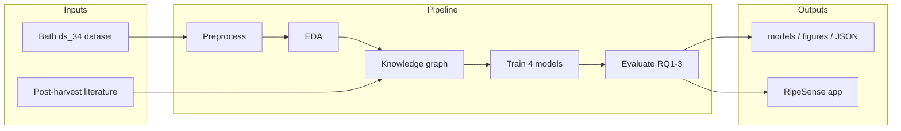

# RipeSense — Knowledge-Integrated Banana Ripeness Prediction

**Author:** Arbind Kumar Gauro (A00074251)  
**Supervisor:** Mohammad Javaheri  
**Programme:** MSc Artificial Intelligence  
**Institution:** University of Roehampton  

---

## Overview

RipeSense is a reproducible software artefact for **post-harvest banana ripeness prediction** using six low-cost **BME280 IoT sensor** readings, augmented with **literature-based knowledge-graph features**. The system trains and compares Random Forest and XGBoost classifiers (baseline vs knowledge-graph augmented), evaluates three research questions (integration, interpretability, robustness), and provides an interactive **Streamlit decision-support dashboard**.



---

## Key results (held-out test set)

| Metric | Value |
|--------|-------|
| **Best model** | KG-augmented XGBoost (`kg_xgb`) |
| **Test macro-F1** | **0.9932** (99.32%) |
| **Test accuracy** | 0.9932 |
| **KG rules accepted** | 13 / 15 |
| **RQ1 — McNemar (XGB baseline vs KG)** | p = 0.522 (not significant at α = 0.05) |
| **RQ2 — SHAP rule alignment (kg_rf)** | 0.33 (humidity rules most aligned) |
| **RQ3 — Missing data (20%)** | ≥ 80% of clean macro-F1 retained |
| **RQ3 — Noise (5%)** | Falls below 80% threshold (deployment risk) |

Full metrics: `outputs/results/model_results.json`

---

## Quick start

Requires **Python 3.11+** (tested on 3.14, Windows). From the repository root:

```bash
# 1. Install dependencies
py -m pip install -r requirements.txt

# 2. Run the full experiment pipeline (~4–5 minutes on CPU)
py -m src.run_pipeline

# 3. Launch the decision-support dashboard
py -m streamlit run app.py
```

Open **http://localhost:8501** in a browser.

> **Note:** Model files (`outputs/models/*.pkl`, ~55 MB) are excluded from Git. They are created automatically when you run the pipeline.

---

## Research questions → code mapping

| RQ | Question | Implementation | Output files |
|----|----------|----------------|--------------|
| **RQ1** | Does KG integration improve prediction? | Four-model ablation + McNemar test | `model_results.json`, confusion matrices |
| **RQ2** | Are SHAP rankings aligned with agronomic rules? | SHAP TreeExplainer + alignment score | `rq2_alignment.json`, `shap_importance_*.json` |
| **RQ3** | Robustness under noise / missing / sensor failure? | Controlled input degradation | `robustness.json`, `robustness_curves.png` |

See [docs/EXPERIMENTS.md](docs/EXPERIMENTS.md) for the full protocol.

---

## Repository structure

```
RipeSense/
├── README.md                 # This file
├── LICENSE                   # MIT
├── requirements.txt          # Python dependencies
├── app.py                    # Streamlit RipeSense dashboard
├── src/                      # Pipeline source code
│   ├── run_pipeline.py       # Main entry point (Phases 1–6)
│   ├── config.py             # Paths, seeds, hyperparameters
│   ├── data_loader.py        # Load, validate, scale data
│   ├── eda.py                # Exploratory analysis + figures
│   ├── knowledge_graph.py    # NetworkX graph construction
│   ├── kg_features.py        # Rule validation + feature engineering
│   ├── train.py              # Model training (RF / XGBoost)
│   ├── evaluate.py           # Metrics, SHAP, McNemar
│   ├── robustness.py         # Noise / missing / failure tests
│   └── decision_support.py   # Inference + recommendations
├── data/
│   ├── ds_34/                # Bath dataset CSVs (train/test)
│   └── kg/                   # Knowledge graph nodes/edges
├── docs/
│   ├── ARCHITECTURE.md       # System design
│   ├── EXPERIMENTS.md        # Evaluation protocol
│   ├── DATASET.md            # Dataset documentation
│   ├── APP_GUIDE.md          # Streamlit user guide
│   └── design/               # Detailed design documents (01–05)
├── scripts/
│   └── verify_setup.py       # Automated smoke test
└── outputs/                  # Generated by pipeline (partially committed)
    ├── results/              # JSON metrics and reports
    ├── figures/              # PNG plots
    └── models/               # *.pkl (gitignored — regenerate locally)
```

---

## Dataset

University of Bath banana ripeness dataset **`ds_34`**, DOI: [10.15125/BATH-01459](https://doi.org/10.15125/BATH-01459)

- **Training:** 18,819 samples | **Test:** 8,066 samples  
- **Features:** 6 BME280 sensors (internal + ambient temperature, humidity, pressure)  
- **Labels:** Ripeness stages 1–5 (perfectly balanced, 20% each class)

Details: [docs/DATASET.md](docs/DATASET.md)

---

## Documentation

| Document | Description |
|----------|-------------|
| [docs/ARCHITECTURE.md](docs/ARCHITECTURE.md) | Layered system design and module responsibilities |
| [docs/EXPERIMENTS.md](docs/EXPERIMENTS.md) | Six-phase pipeline and evaluation protocol |
| [docs/DATASET.md](docs/DATASET.md) | Feature definitions, ranges, exclusions |
| [docs/APP_GUIDE.md](docs/APP_GUIDE.md) | Streamlit pages and demo script |
| [docs/design/](docs/design/) | Original design documents (workflow, architecture, implementation plan) |

---

## Verification

After installation, run the automated smoke test:

```bash
py scripts/verify_setup.py
```

This checks imports, data files, pipeline outputs, and Live Prediction inference.

---

## Publishing to GitHub

From inside the `RipeSense/` folder:

```bash
git init
git add .
git commit -m "Add reproducible RipeSense pipeline, evaluation artefacts, and decision-support app"
git branch -M main
git remote add origin https://github.com/YOUR_USERNAME/RipeSense-banana-ripeness.git
git push -u origin main
```

Suggested repository name: **`RipeSense-banana-ripeness`** or **`knowledge-integrated-banana-ripeness`**

---

## Professor submission checklist

| Item | Location |
|------|----------|
| GitHub repository URL | Submit link to this repo |
| Reproduction commands | Quick start section above |
| Dataset citation | [docs/DATASET.md](docs/DATASET.md) — DOI 10.15125/BATH-01459 |
| Live demo | `py -m streamlit run app.py` → Live Prediction page |
| Screencast | Follow [docs/APP_GUIDE.md](docs/APP_GUIDE.md) demo script (8–12 min) |
| Written dissertation | Submitted separately via Turnitin (not in this repo) |

---

## Licence

MIT Licence — see [LICENSE](LICENSE).

## Citation

If you use this code or methodology, please cite the Bath dataset:

> Callaghan, K. & Martinez Hernandez, U. (2025). *Dataset for Low-Cost, Multi-Sensor Non-Destructive Banana Ripeness Estimation Using Machine Learning.* University of Bath Research Data Archive. https://doi.org/10.15125/BATH-01459
