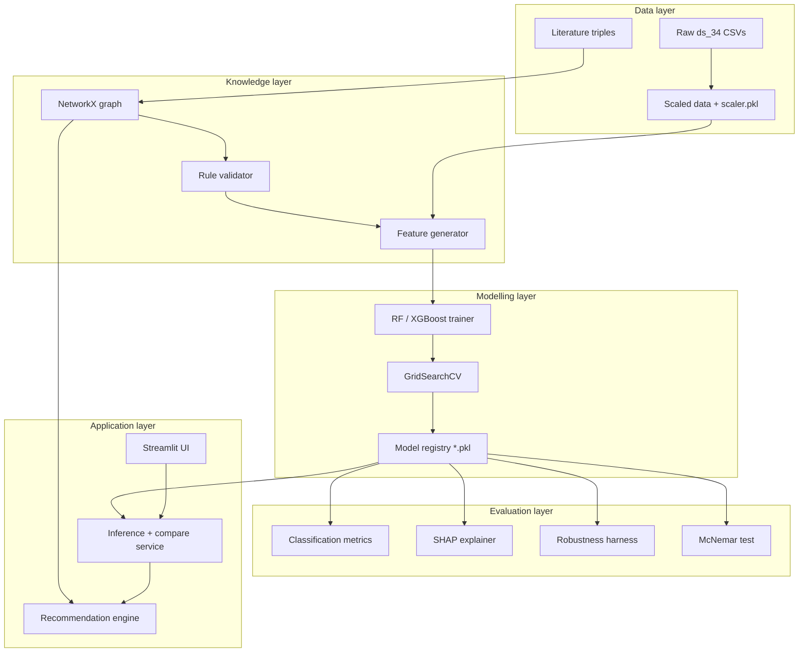
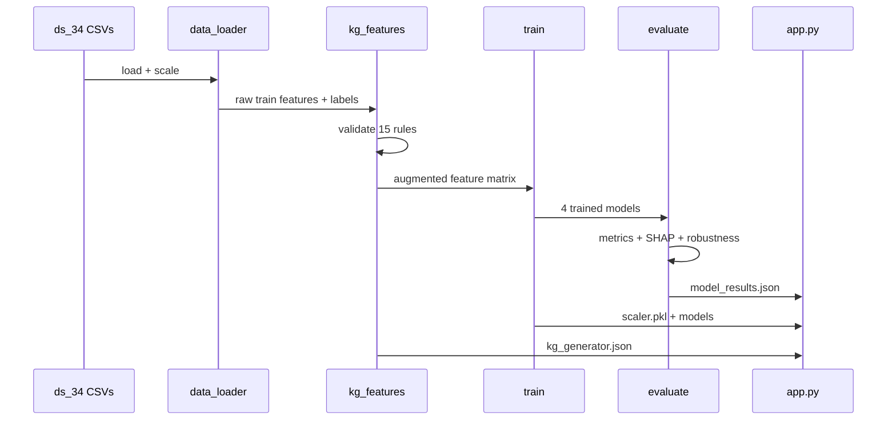

# System architecture

RipeSense implements a **layered, batch-oriented machine-learning pipeline** with a Streamlit front end. Each layer has a single responsibility and communicates through serialised artefacts (CSV, JSON, PKL, PNG).

---

## Layer diagram

---

## Module responsibilities

| Module | Layer | Responsibility |
|--------|-------|----------------|
| `config.py` | Cross-cutting | Paths, random seed (42), sensor list, KG rules, hyperparameter grids, thresholds |
| `data_loader.py` | Data | Load CSVs, validate ranges, detect outliers, min–max scale, return `DataBundle` |
| `eda.py` | Data | Class distribution, correlation heatmap, per-stage box plots, quartiles |
| `knowledge_graph.py` | Knowledge | Build directed NetworkX graph from literature triples; export nodes/edges |
| `kg_features.py` | Knowledge | Validate rules (activation ≥ 5%, chi² p < 0.05); generate flag/risk/count features |
| `train.py` | Modelling | Label encoding, GridSearchCV, train 4 models, persist `.pkl` |
| `evaluate.py` | Evaluation | Test metrics, confusion matrices, McNemar, SHAP, alignment score |
| `robustness.py` | Evaluation | Gaussian noise, missingness, dual sensor failure sweeps |
| `decision_support.py` | Application | Single-row inference, fired rules, storage recommendations |
| `run_pipeline.py` | Orchestration | Execute Phases 1–6 sequentially; write `model_results.json` |
| `app.py` | Application | Eight-page Streamlit dashboard incl. Architecture & Decision Support |

---

## Data flow

---

## Knowledge-graph feature engineering

Each literature triple becomes tabular columns:

| Feature type | Example | Purpose |
|--------------|---------|---------|
| Binary flag | `flag_R1` | 1 if Temp-int > threshold |
| Risk score | `risk_R1` | Normalised distance past threshold (cap 5.0) |
| Violation count | `kg_violation_count` | Sum of fired rules per row |

Interaction rules (e.g. R14 both temps high) generate flags only.

**Validation gate (training data only):**
- Activation rate ≥ 5%
- Chi-squared p < 0.05 vs ripeness label

---

## Configuration centralisation

All magic numbers live in `src/config.py`:

- `RANDOM_STATE = 42`
- `SENSOR_FEATURES` — six BME280 column names
- `KG_RULES` — fifteen candidate triples with thresholds and literature sources
- `MIN_ACTIVATION_RATE = 0.05`
- `CHI2_ALPHA = 0.05`
- Hyperparameter grids for RF and XGBoost
- Robustness noise/missing levels

---

## Artefact contracts

| Producer | Consumer | Artefact |
|----------|----------|----------|
| `data_loader` | `train`, `app` | `scaler.pkl` |
| `kg_features` | `train`, `app` | `kg_generator.json` |
| `train` | `evaluate`, `app` | `*.pkl` models |
| `evaluate` | `app` | `model_results.json` |
| `eda` | `kg_features` | `eda_summary.json` (quartiles) |

Files on disk enable independent phase execution and examiner audit without re-running the full pipeline.

---

## Design principles

1. **Reproducibility** — fixed seeds, author split, train-only fitting  
2. **Separation of concerns** — one module per pipeline phase  
3. **No GPU requirement** — CPU-only scikit-learn and XGBoost  
4. **Transparent knowledge** — KG rules are human-readable CSV/JSON, not black-box embeddings  
5. **Human-in-the-loop** — decision support only; no autonomous ripening control  

For extended design rationale, see `docs/design/01_high_level_design_and_workflow.md` through `docs/design/05_data_story_and_dataset_rationale.md`.
