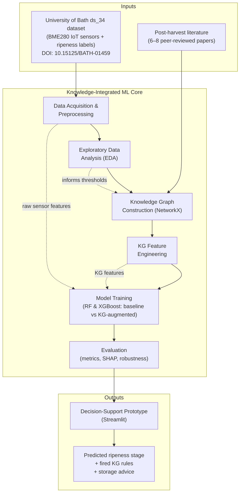
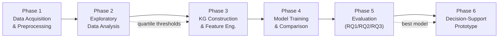
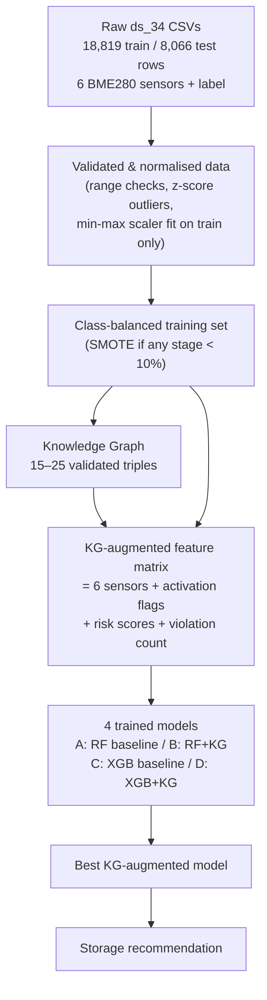

# Deliverable 1 — High-Level Design, Workflow and Explanation

**Project:** Knowledge-Integrated Supervised Learning for Post-Harvest Banana Ripeness Prediction Using IoT Sensor Data
**Author:** Arbind Kumar Gauro (A00074251)
**Supervisor:** Mohammad Javaheri
**Programme:** MSc Artificial Intelligence

---

## 1. Purpose of this Document

This document gives a *bird's-eye* view of the whole system before any code is written. It explains:

1. **What the system does** at a conceptual level.
2. **The high-level block diagram** (the main building blocks and how they connect).
3. **The end-to-end workflow** (the order of operations from raw data to a storage recommendation).
4. **A plain-language explanation** of each stage and *why* it exists.

The detailed component design lives in `02_system_architecture_design.md`, and the time-boxed build plan lives in `03_implementation_plan.md`.

---

## 2. One-Paragraph Summary

The system predicts the **ripeness stage of bananas (stages 1–5)** from low-cost IoT sensor readings, and crucially it **fuses those raw sensor values with domain knowledge** taken from peer-reviewed post-harvest literature. That knowledge is encoded as a small **knowledge graph (KG)** of `subject–predicate–object` triples (for example, *high internal temperature → accelerates → ripening*). The KG is converted into extra tabular features that are appended to the raw sensors, and a classifier is trained on this enriched feature set. The central research claim is that **adding KG features improves prediction accuracy, interpretability, and robustness** compared with a sensor-only baseline [8], [9]. A small Streamlit tool turns a prediction into a plain-language storage recommendation.

---

## 3. High-Level Block Diagram

**How to read it:** Two information sources flow in on the left — the *measured* sensor data (`ds_34`) and the *expert* knowledge from literature. They meet inside the **Knowledge Graph Construction** block, which is the conceptual heart of the project. From there the combined knowledge is turned into numeric features, used to train and compare models, evaluated, and finally surfaced to a user through a lightweight app.

---

## 4. End-to-End Workflow

### 4.1 Detailed data-flow view

---

## 5. Stage-by-Stage Explanation

### Phase 1 — Data Acquisition and Preprocessing
The open-access `ds_34` subset is downloaded from the Bath Research Data Archive (DOI: 10.15125/BATH-01459) [3]. It contains **18,819 training** and **8,066 test** rows, each with six BME280 readings (`Temp-int`, `Humid-int`, `Press-int`, `Temp-ext`, `Humid-ext`, `Press-ext`) and a ripeness label (stages 1–5). Preprocessing applies **range validation** (e.g. temperature flagged outside 5–35 °C, humidity outside 30–95%), **z-score outlier detection**, and **min-max normalisation fitted on the training set only** — the same scaler is reused on the test set to prevent data leakage. If any ripeness stage is under-represented (< 10% of rows), **SMOTE oversampling** is applied to the training set only.
*Why it exists:* clean, leak-free, balanced data is the foundation for every later comparison to be fair.

### Phase 2 — Exploratory Data Analysis (EDA)
Per-stage box plots, a Pearson correlation heatmap (to catch multicollinearity), and stage-level means/standard deviations are produced.
*Why it exists:* EDA tells us *which sensors separate ripeness stages most clearly* and supplies the empirical **quartile boundaries** later used to set knowledge-graph rule thresholds.

### Phase 3 — Knowledge Graph Construction and Feature Engineering
A directed graph of **15–25 triples** is built with **NetworkX** from 6–8 peer-reviewed papers [1], [6], [7] — e.g. *(high internal temperature) –[accelerates]– (ripening)*. Each rule's numeric threshold is set from **published values combined with EDA quartiles**. Every rule is **validated against the training data**: kept only if its activation rate ≥ 5% and a chi-squared test shows a significant association (p < 0.05) with the label. Validated rules become three feature types following Perković et al. [8]:
1. **Binary activation flags** (rule satisfied = 1).
2. **Continuous risk scores** (sensor value ÷ threshold).
3. **Aggregate violation count** (number of rules fired per row).
*Why it exists:* this is the project's core contribution — turning symbolic expert knowledge into machine-readable features **without** a graph neural network.

### Phase 4 — Model Training and Comparison
Four models are trained on the author-provided split: **A = RF baseline**, **B = RF + KG**, **C = XGBoost baseline**, **D = XGBoost + KG** [9], [10]. Hyperparameters are tuned by **5-fold cross-validation with macro-F1** scoring; seeds are fixed.
*Why it exists:* the A-vs-B and C-vs-D pairs form a clean **ablation** that isolates the effect of the KG features.

### Phase 5 — Evaluation (answers the three research questions)
- **RQ1 (Integration):** compare macro-F1, accuracy, weighted precision/recall (baseline vs KG); a **McNemar test** checks significance.
- **RQ2 (Interpretability):** **SHAP** summary plots [11] are scored against a checklist of expected agronomic directions (alignment score).
- **RQ3 (Robustness):** test set is degraded with Gaussian noise (5/10/20%), missing values (5/10/20%), and a simulated sensor-pair failure; macro-F1 is reported as a % of clean performance.
*Why it exists:* it provides the evidence that the integration hypothesis holds — or not.

### Phase 6 — Decision-Support Prototype
A **Streamlit** app accepts six sensor readings (manual entry or CSV row) and returns the predicted stage, a confidence score, **which KG rules fired**, and a plain-language storage tip (e.g. *"Internal temperature above threshold: reduce storage temperature to slow ripening"*).
*Why it exists:* it demonstrates how symbolic knowledge surfaces *actionable* advice alongside a prediction — it is a demonstrator, not a production controller.

---

## 6. Key Design Principles

| Principle | How it is honoured |
|---|---|
| **Reproducibility** | Fixed seeds, author-provided train/test split, scaler fit on train only [12] |
| **Fair comparison** | Identical data and metrics across all four models; KG features are the only changing variable |
| **No data leakage** | Normalisation, SMOTE, and rule validation use the training set only |
| **Interpretability first** | SHAP + a literature rule checklist make every prediction explainable [11] |
| **Low-cost / no GPU** | Tabular ML on a standard laptop; all tools open-source |
| **Human-in-the-loop** | Prototype gives advice; a human operator decides [3] |

---

## 7. References (IEEE)

[1] M. W. Siddiqui et al., *Postharvest Biology and Technology of Tropical and Subtropical Fruits*. Woodhead Publishing, 2016.
[2] K. G. Liakos et al., "Machine learning in agriculture: A review," *Sensors*, vol. 18, no. 8, p. 2674, 2018.
[3] K. Callaghan and U. Martinez Hernandez, "Dataset for Low-Cost, Multi-Sensor Non-Destructive Banana Ripeness Estimation Using Machine Learning," Univ. Bath Res. Data Archive, 2025. [Online]. Available: https://doi.org/10.15125/BATH-01459
[6] J. B. Golding, D. Shearer, S. G. Wyllie, and W. B. McGlasson, "Application of 1-MCP and ethylene to avocado fruit," *Postharvest Biology and Technology*, 2015.
[7] S. Saranwong, S. Ketsa, and W. G. van Doorn, "Ripening and quality of mango fruit," *Postharvest Biology and Technology*, 2016.
[8] M. Perković et al., "Automating feature extraction from entity-relation models: Experimental evaluation of machine learning methods for relational learning," *Data*, vol. 8, no. 4, p. 39, 2024.
[9] L. Breiman, "Random forests," *Machine Learning*, vol. 45, no. 1, pp. 5–32, 2001.
[10] T. Chen and C. Guestrin, "XGBoost: A scalable tree boosting system," in *Proc. ACM SIGKDD*, 2016, pp. 785–794.
[11] S. M. Lundberg and S.-I. Lee, "A unified approach to interpreting model predictions," in *NeurIPS*, 2017, pp. 4765–4774.
[12] P. Cortez et al., "Modeling wine preferences by data mining from physicochemical properties," *Decision Support Systems*, vol. 47, no. 4, pp. 547–553, 2009.
