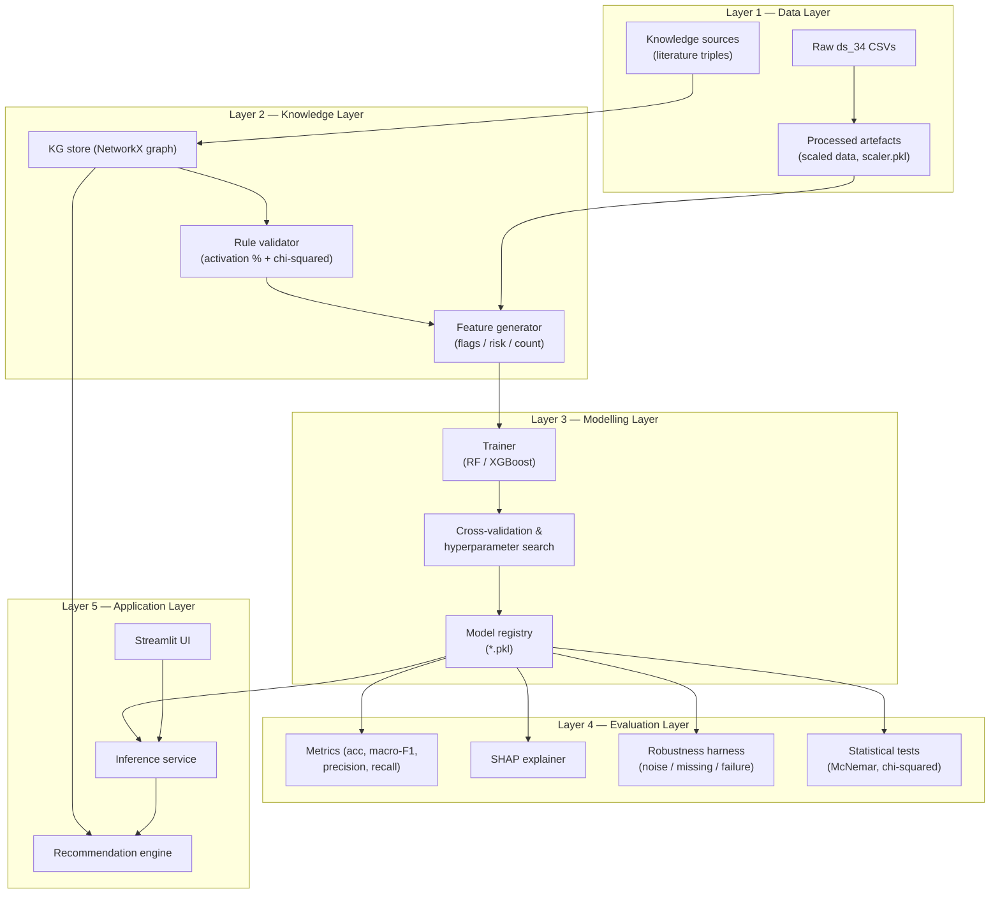
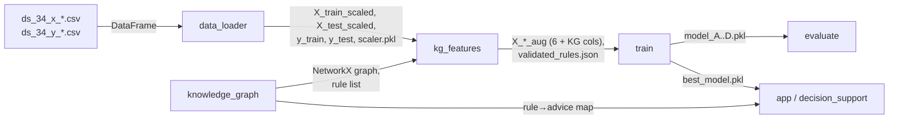
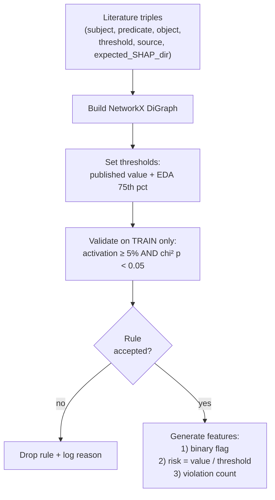
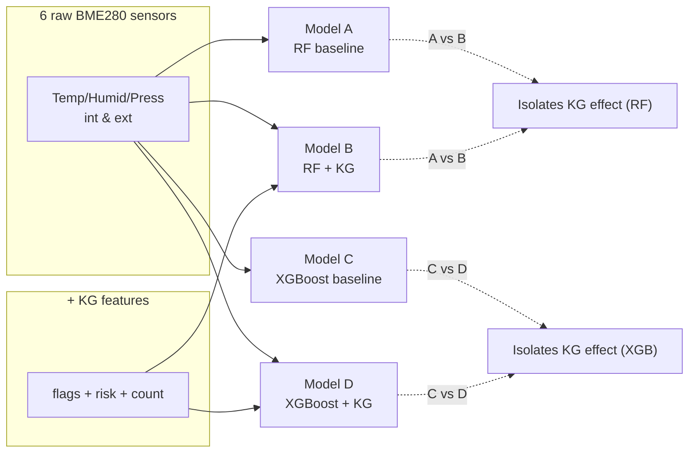
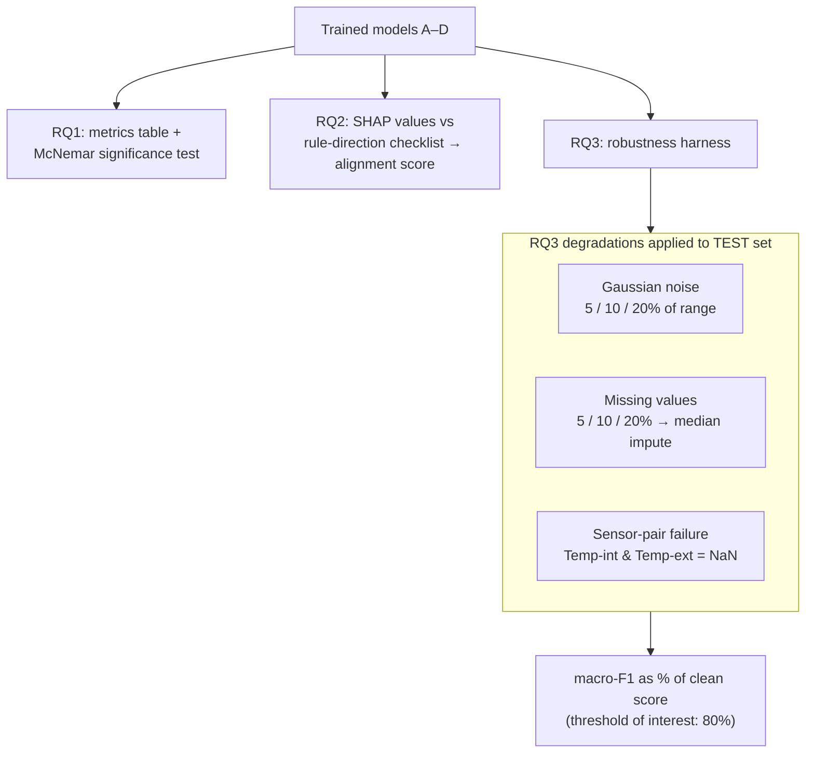
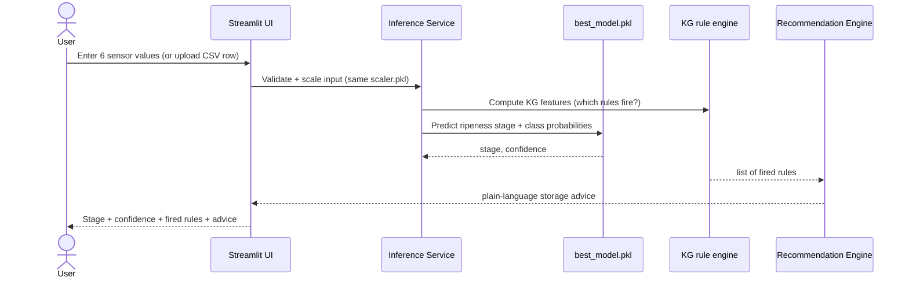

# Deliverable 2 — System and Architecture Design

**Project:** Knowledge-Integrated Supervised Learning for Post-Harvest Banana Ripeness Prediction Using IoT Sensor Data
**Author:** Arbind Kumar Gauro (A00074251)

---

## 1. Architectural Overview

The system is a **modular, batch-oriented machine-learning pipeline** with a thin interactive front end. It follows a classic **layered architecture**: each layer has a single responsibility, communicates with neighbours through well-defined artefacts (CSV / pickle / JSON files), and can be tested in isolation. There is **no database server and no GPU requirement** — everything runs as Python modules on a standard laptop, which matches the reproducibility and low-cost goals of the proposal [3], [12].

---

## 2. Component Design

### 2.1 Component responsibilities

| Module (proposed) | Layer | Responsibility | Key libraries |
|---|---|---|---|
| `config.py` | cross-cutting | Central paths, seeds, hyperparameter grids, thresholds | — |
| `data_loader.py` | Data | Load `ds_34`, validate ranges, detect outliers, scale, SMOTE | pandas, numpy, scikit-learn, imbalanced-learn |
| `eda.py` | Data | Box plots, correlation heatmap, per-stage statistics, quartiles | pandas, matplotlib, seaborn |
| `knowledge_graph.py` | Knowledge | Build NetworkX KG from literature triples; persist `nodes.csv`/`edges.csv` | networkx |
| `kg_features.py` | Knowledge | Validate rules (activation %, chi-squared); generate flag/risk/count features | scipy, pandas |
| `train.py` | Modelling | Train 4 models, 5-fold CV tuning, fixed seeds, save `*.pkl` | scikit-learn, xgboost |
| `evaluate.py` | Evaluation | Metrics, SHAP, McNemar, robustness sweeps | scikit-learn, shap, scipy |
| `robustness.py` | Evaluation | Inject noise / missingness / sensor failure; recompute macro-F1 | numpy, pandas |
| `decision_support.py` | Application | Map prediction + fired rules → storage advice | networkx, pandas |
| `app.py` | Application | Streamlit UI: input, predict, explain | streamlit |
| `run_pipeline.py` | orchestration | Run Phases 1→6 end to end | — |

> Note: module names mirror the proposal's methodology so the report and code stay aligned. The previous code has been cleared; this design is the blueprint for the rebuild described in `03_implementation_plan.md`.

### 2.2 Data contracts between components

Each arrow is a **file artefact** on disk (CSV, `.pkl`, `.json`, `.png`). This keeps stages decoupled and re-runnable, and makes every result auditable for the dissertation.

---

## 3. The Knowledge Graph Sub-System (core contribution)

**Design rationale:**
- A **directed graph** (`DiGraph`) is used because relationships are directional (*temperature → accelerates → ripening*). This is a knowledge *graph*, not a full rule-based expert system [8].
- Storing triples with an `expected_SHAP_direction` field means the **RQ2 interpretability checklist is built into the data model**, not bolted on afterwards.
- Rule validation is a **gatekeeper**: only empirically supported triples become features, which protects the model from spurious literature rules that do not hold in `ds_34`.

### Example triple schema

| subject | predicate | object | threshold | source | expected_SHAP_dir |
|---|---|---|---|---|---|
| internal_temperature | accelerates | ripening | > 20 °C | Golding et al. [6] | + toward higher stage |
| internal_humidity | slows | moisture_loss | > 85% | Siddiqui et al. [1] | context |
| ripeness_stage_4_5 | associated_with | short_shelf_life | stage ≥ 4 | Saranwong et al. [7] | + |

---

## 4. Modelling Architecture (the four-model ablation)

- **Why two algorithms?** Random Forest [9] and XGBoost [10] are both strong on tabular sensor data but use bagging vs boosting respectively; showing the KG helps *both* strengthens the claim that the gain comes from the features, not one lucky algorithm.
- **Why macro-F1 for tuning?** The classes (ripeness stages) may be imbalanced, and macro-F1 weights every stage equally, avoiding bias toward the majority stage.
- **Reproducibility:** fixed random seeds and the author-provided split mean any reader can re-run and obtain the same numbers [12].

---

## 5. Evaluation Architecture

---

## 6. Application Architecture (Streamlit prototype)

**Design notes:**
- The **same `scaler.pkl`** from training is reused at inference — no re-fitting — so live inputs are transformed identically to training data.
- The recommendation engine is **rule-driven**, not learned: each fired KG rule maps to a human-readable tip, keeping advice transparent and auditable [11].
- The app is explicitly a **decision-support demonstrator** with a human-in-the-loop, not an automatic controller [3].

---

## 7. Technology Stack

| Concern | Technology | Reason |
|---|---|---|
| Language | Python 3.11 | Ecosystem maturity, proposal commitment |
| Data handling | pandas, NumPy | Standard tabular processing |
| Classical ML | scikit-learn (Random Forest) | Robust baseline [9] |
| Boosting | XGBoost | Strong tabular performance [10] |
| Imbalance | imbalanced-learn (SMOTE) | Train-only oversampling |
| Knowledge graph | NetworkX | Lightweight in-memory graph, no GNN [8] |
| Explainability | SHAP | Unified feature attribution [11] |
| Statistics | SciPy | Chi-squared, McNemar tests |
| Visualisation | matplotlib, seaborn | EDA + result plots |
| Front end | Streamlit | Fast local prototype |

All components are **open-source** and run **without GPU**.

---

## 8. Non-Functional Requirements

| Attribute | Target / approach |
|---|---|
| **Reproducibility** | Fixed seeds; deterministic split; artefacts versioned on disk [12] |
| **Auditability** | Every stage emits an inspectable file (CSV/JSON/PNG/PKL) |
| **No data leakage** | Scaler, SMOTE and rule validation fit on training data only |
| **Performance** | Full pipeline runs in minutes on a laptop CPU |
| **Maintainability** | One module per responsibility; config centralised |
| **Explainability** | SHAP + KG-rule trace for every prediction [11] |
| **Ethical safety** | Human-in-the-loop; clear risk labelling in the UI [3] |

---

## 9. References (IEEE)

[1] M. W. Siddiqui et al., *Postharvest Biology and Technology of Tropical and Subtropical Fruits*. Woodhead Publishing, 2016.
[3] K. Callaghan and U. Martinez Hernandez, "Dataset for Low-Cost, Multi-Sensor Non-Destructive Banana Ripeness Estimation Using Machine Learning," Univ. Bath Res. Data Archive, 2025. [Online]. Available: https://doi.org/10.15125/BATH-01459
[6] J. B. Golding et al., "Application of 1-MCP and ethylene to avocado fruit," *Postharvest Biology and Technology*, 2015.
[7] S. Saranwong, S. Ketsa, and W. G. van Doorn, "Ripening and quality of mango fruit," *Postharvest Biology and Technology*, 2016.
[8] M. Perković et al., "Automating feature extraction from entity-relation models," *Data*, vol. 8, no. 4, p. 39, 2024.
[9] L. Breiman, "Random forests," *Machine Learning*, vol. 45, no. 1, pp. 5–32, 2001.
[10] T. Chen and C. Guestrin, "XGBoost: A scalable tree boosting system," in *Proc. ACM SIGKDD*, 2016, pp. 785–794.
[11] S. M. Lundberg and S.-I. Lee, "A unified approach to interpreting model predictions," in *NeurIPS*, 2017, pp. 4765–4774.
[12] P. Cortez et al., "Modeling wine preferences by data mining from physicochemical properties," *Decision Support Systems*, vol. 47, no. 4, pp. 547–553, 2009.
