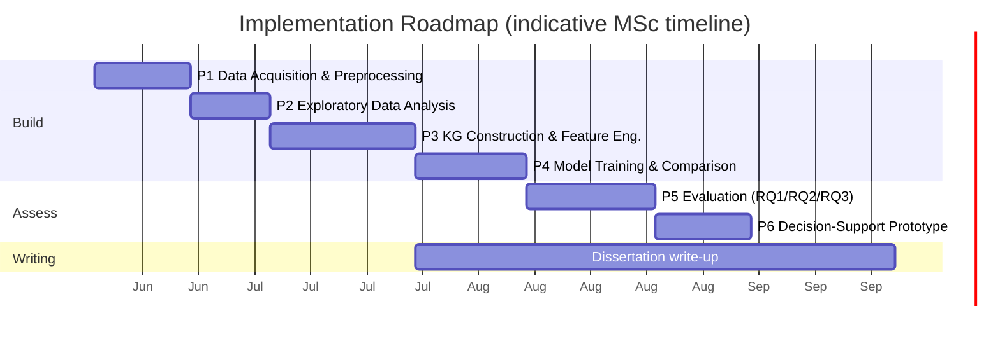

# Deliverable 3 — Phase-Wise Implementation Plan

**Project:** Knowledge-Integrated Supervised Learning for Post-Harvest Banana Ripeness Prediction Using IoT Sensor Data
**Author:** Arbind Kumar Gauro (A00074251)

This plan turns the architecture in `02_system_architecture_design.md` into an ordered, citable build sequence. Each phase lists its **goal, tasks, inputs/outputs, tools, success criteria, risks, and citations**. The six phases follow the methodology in the revised proposal exactly.

---

## Roadmap at a Glance

---

## Phase 1 — Data Acquisition and Preprocessing

**Goal:** Produce a clean, leak-free, class-balanced dataset ready for feature engineering.

**Tasks**
1. Download / confirm the `ds_34` subset from the Bath Research Data Archive (DOI: 10.15125/BATH-01459) [3].
2. Load `ds_34_x_train`, `ds_34_x_test`, `ds_34_y_train`, `ds_34_y_test`; restrict to the **six BME280 features** (`Temp-int`, `Humid-int`, `Press-int`, `Temp-ext`, `Humid-ext`, `Press-ext`) per project scope.
3. **Range validation** — flag temperature outside 5–35 °C and humidity outside 30–95%.
4. **Z-score outlier detection** on each feature.
5. **Min-max normalisation fitted on the training set only**; persist `scaler.pkl` and reuse on the test set to prevent leakage [12].
6. **Class-balance check** with a frequency table; if any ripeness stage < 10% of rows, apply **SMOTE to the training set only**.

**Inputs:** raw `ds_34` CSVs. **Outputs:** `X_train_scaled`, `X_test_scaled`, `y_train`, `y_test`, `scaler.pkl`, class-balance report.

**Tools:** pandas, NumPy, scikit-learn, imbalanced-learn.

**Success criteria:** no leakage (scaler fit on train only), documented class distribution, reproducible load.

**Risks & mitigations:** label indexing differs from "stages 1–5" → confirm mapping before modelling; SMOTE distorts distribution → apply to train only and report pre/post counts.

**Citations:** dataset [3]; reproducible-split rationale [12].

---

## Phase 2 — Exploratory Data Analysis

**Goal:** Understand how sensors separate ripeness stages and derive empirical thresholds for Phase 3.

**Tasks**
1. Per-stage **box plots** for all six features.
2. **Pearson correlation heatmap** to detect multicollinearity.
3. **Stage-level means and standard deviations** table.
4. Compute **per-stage quartile boundaries** (notably the 75th percentile) for later KG thresholds.

**Inputs:** scaled training data. **Outputs:** `eda_summary.json`, figures (`class_distribution.png`, `correlation_heatmap.png`, `sensor_by_stage.png`), quartile table.

**Tools:** pandas, matplotlib, seaborn.

**Success criteria:** clear identification of the most discriminative sensors; documented quartiles feeding Phase 3.

**Risks & mitigations:** high multicollinearity reduces individual feature value → note it and rely on KG-derived composite features.

**Citations:** ML-in-agriculture context [2].

---

## Phase 3 — Knowledge Graph Construction and Feature Engineering

**Goal:** Build a validated KG and convert it into tabular features (the core contribution).

**Tasks**
1. Extract **15–25 candidate triples** from 6–8 peer-reviewed post-harvest papers [1], [6], [7], stored as `(subject, predicate, object, threshold, source, expected_SHAP_direction)`.
2. Build a **NetworkX directed graph**; persist `nodes.csv` and `edges.csv`.
3. **Threshold selection:** combine published values (e.g. accelerated ripening above ~20 °C [6]) with the EDA 75th-percentile boundaries; where a published threshold lies outside the observed `ds_34` range, substitute the EDA quartile and **document the substitution**.
4. **Rule validation on training data only:** keep a rule if activation rate ≥ 5% **and** a chi-squared test gives p < 0.05 for association with the label; log dropped rules and reasons [8].
5. **Feature generation** following Perković et al. [8]:
   - binary **activation flags**,
   - continuous **risk scores** (`value / threshold`),
   - aggregate **violation count**.
6. Append KG features to the six sensors → **KG-augmented feature matrix**.

**Inputs:** validated training data + quartiles. **Outputs:** `nodes.csv`, `edges.csv`, `validated_rules.json`, `X_train_aug`, `X_test_aug`.

**Tools:** NetworkX, SciPy (chi-squared), pandas.

**Success criteria:** ≥ 10 validated, empirically-grounded triples; reproducible feature matrix; every rule traceable to a citation.

**Risks & mitigations:** too few rules survive validation → broaden literature set; thresholds unstable → document the published-vs-EDA decision for each rule.

**Citations:** KG concept and shelf-life/sugar relationships [1], [6], [7]; KG-to-tabular feature method [8].

---

## Phase 4 — Model Training and Comparison

**Goal:** Train the four-model ablation and select the best KG-augmented model.

**Tasks**
1. Train **Model A** (RF, raw sensors) and **Model B** (RF + KG) [9].
2. Train **Model C** (XGBoost, raw sensors) and **Model D** (XGBoost + KG) [10].
3. Tune hyperparameters (n_estimators, max_depth, learning rate) with **5-fold cross-validation scored on macro-F1** to avoid majority-class bias.
4. **Fix all random seeds**; persist `model_A..D.pkl` and `best_model.pkl`.

**Inputs:** raw and KG-augmented matrices. **Outputs:** four model files, CV results, selected best model.

**Tools:** scikit-learn, XGBoost.

**Success criteria:** A↔B and C↔D differ only by KG features; reproducible CV scores.

**Risks & mitigations:** overfitting → CV + held-out test set; class imbalance → macro-F1 scoring + Phase-1 SMOTE.

**Citations:** Random Forest [9]; XGBoost [10]; reproducible evaluation practice [12].

---

## Phase 5 — Evaluation (RQ1, RQ2, RQ3)

**Goal:** Produce the evidence that answers the three research questions.

**Tasks**
1. **RQ1 (Integration):** compare accuracy, macro-F1, weighted precision/recall (baseline vs KG) on the test set; run a **McNemar test** for significance.
2. **RQ2 (Interpretability):** generate **SHAP** summary plots [11]; build a rule-direction checklist from validated triples; report the **alignment score** (proportion of SHAP rankings matching expected agronomic direction).
3. **RQ3 (Robustness):** apply to the test set —
   - Gaussian **noise** at 5 / 10 / 20% of sensor range,
   - random **missing values** at 5 / 10 / 20% (median-imputed),
   - **sensor-pair failure** (Temp-int and Temp-ext set to NaN);
   report macro-F1 as a **percentage of clean-data performance** and identify where it drops below 80%.

**Inputs:** trained models, test set. **Outputs:** `model_results.json`/`.txt`, SHAP figures, `robustness_shap.json`, alignment scores.

**Tools:** scikit-learn, SHAP, SciPy.

**Success criteria:** statistically tested RQ1 result; quantified RQ2 alignment; full RQ3 degradation curves.

**Risks & mitigations:** improvement not significant → still a valid negative result, report honestly; SHAP runtime → sample test rows if needed.

**Citations:** SHAP [11]; evaluation methodology [12].

---

## Phase 6 — Decision-Support Prototype

**Goal:** Demonstrate KG-driven, explainable storage advice in a local app.

**Tasks**
1. Build a **Streamlit** UI accepting six sensor readings (manual or CSV row).
2. Reuse `scaler.pkl`; compute KG features; run `best_model.pkl` for stage + confidence.
3. Show **which KG rules fired** and a **plain-language storage recommendation** (e.g. "Internal temperature above threshold: reduce storage temperature to slow ripening").
4. Add **risk labelling** and a human-in-the-loop disclaimer.

**Inputs:** best model, KG, scaler. **Outputs:** running `app.py`, recommendation logic in `decision_support.py`.

**Tools:** Streamlit, NetworkX, pandas.

**Success criteria:** correct end-to-end inference; transparent rule trace; clear non-production disclaimer.

**Risks & mitigations:** over-reliance by users → explicit risk labels and human-in-the-loop wording [3].

**Citations:** dataset / human-in-the-loop framing [3]; explainability [11]; food-waste motivation [1].

---

## Cross-Cutting Concerns

| Concern | Approach | Citation |
|---|---|---|
| Reproducibility | Fixed seeds, author split, on-disk artefacts | [12] |
| No data leakage | Scaler / SMOTE / rule validation on train only | [12] |
| Interpretability | SHAP + literature rule checklist | [11] |
| Ethics & safety | Decision-support only, human-in-the-loop | [3] |
| Open / low-cost | All open-source, CPU-only | [4] |

---

## Definition of Done

- [ ] Phases 1–6 each emit their documented artefacts.
- [ ] Four models trained with a clean KG ablation.
- [ ] RQ1 result with McNemar significance reported.
- [ ] RQ2 SHAP alignment score reported for each model.
- [ ] RQ3 robustness curves (noise / missing / failure) reported.
- [ ] Streamlit prototype runs end to end with rule trace + advice.
- [ ] Every KG rule traceable to a cited source.

---

## References (IEEE)

[1] M. W. Siddiqui et al., *Postharvest Biology and Technology of Tropical and Subtropical Fruits*. Woodhead Publishing, 2016.
[2] K. G. Liakos et al., "Machine learning in agriculture: A review," *Sensors*, vol. 18, no. 8, p. 2674, 2018.
[3] K. Callaghan and U. Martinez Hernandez, "Dataset for Low-Cost, Multi-Sensor Non-Destructive Banana Ripeness Estimation Using Machine Learning," Univ. Bath Res. Data Archive, 2025. [Online]. Available: https://doi.org/10.15125/BATH-01459
[4] A. Kamilaris and F. X. Prenafeta-Boldú, "Deep learning in agriculture: A survey," *Computers and Electronics in Agriculture*, vol. 147, pp. 70–90, 2018.
[6] J. B. Golding, D. Shearer, S. G. Wyllie, and W. B. McGlasson, "Application of 1-MCP and ethylene to avocado fruit," *Postharvest Biology and Technology*, 2015.
[7] S. Saranwong, S. Ketsa, and W. G. van Doorn, "Ripening and quality of mango fruit," *Postharvest Biology and Technology*, 2016.
[8] M. Perković et al., "Automating feature extraction from entity-relation models: Experimental evaluation of machine learning methods for relational learning," *Data*, vol. 8, no. 4, p. 39, 2024.
[9] L. Breiman, "Random forests," *Machine Learning*, vol. 45, no. 1, pp. 5–32, 2001.
[10] T. Chen and C. Guestrin, "XGBoost: A scalable tree boosting system," in *Proc. ACM SIGKDD Int. Conf. Knowl. Discovery Data Mining (KDD)*, 2016, pp. 785–794.
[11] S. M. Lundberg and S.-I. Lee, "A unified approach to interpreting model predictions," in *Advances in Neural Information Processing Systems (NeurIPS)*, 2017, pp. 4765–4774.
[12] P. Cortez, A. Cerdeira, F. Almeida, T. Matos, and J. Reis, "Modeling wine preferences by data mining from physicochemical properties," *Decision Support Systems*, vol. 47, no. 4, pp. 547–553, 2009.
