# The Life of a Banana — From Flower to Plate, and Why a Machine Should Care

**Companion to the project:** Knowledge-Integrated Supervised Learning for Post-Harvest Banana Ripeness Prediction Using IoT Sensor Data
**Author:** Arbind Kumar Gauro (A00074251)

> **How to read this document.** This is the "explain-everything-from-scratch" story. It assumes no prior knowledge and builds up, in sequence, from *what a banana is* to *why our specific machine-learning approach is the right tool for the job*. Diagrams accompany every major idea. Citations use IEEE style `[n]` and resolve to the [References](#references-ieee) at the end.

---

## Table of Contents

1. [Prologue: a banana's journey](#1-prologue-a-bananas-journey)
2. [What a banana actually is (botany in one minute)](#2-what-a-banana-actually-is)
3. [The full life cycle: from sucker to shelf](#3-the-full-life-cycle-from-sucker-to-shelf)
4. [The science of ripening: ethylene, respiration, starch and sugar](#4-the-science-of-ripening)
5. [The colour stages: green to yellow to brown](#5-the-colour-stages)
6. [The four environmental levers: temperature, humidity, ethylene, atmosphere](#6-the-four-environmental-levers)
7. [Man-made ripening: how ripening rooms work](#7-man-made-ripening-how-ripening-rooms-work)
8. [The UK context: a nation of green imports](#8-the-uk-context)
9. [Does this problem actually need solving?](#9-does-this-problem-actually-need-solving)
10. [What kinds of data could solve it?](#10-what-kinds-of-data-could-solve-it)
11. [Technical approaches and their trade-offs (with edge cases)](#11-technical-approaches-and-their-trade-offs)
12. [Final verdict: why our approach is effective](#12-final-verdict)
13. [How often do we need data in a real deployment?](#13-how-often-do-we-need-data)
14. [References](#references-ieee)

---

## 1. Prologue: a banana's journey

Imagine a single banana. It begins its life on a tall herb in a humid tropical field in Ecuador or Colombia, is cut down while still hard and grass-green, travels thousands of kilometres in a refrigerated ship, sits in a sealed room in the UK where a puff of gas wakes it up, turns the familiar yellow over a few days, and finally lands in a fruit bowl — where, within a week, it may turn into a speckled brown casualty of the bin [1], [8]. Every step of that journey is a race against an invisible clock driven by chemistry. **Our project is, in essence, an attempt to read that clock from cheap sensors and tell people how much time is left.**

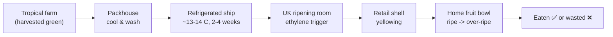

The tragedy the project targets is the last arrow: the fork between *eaten* and *wasted*. That fork is decided by storage conditions and timing — exactly the things sensors can measure and knowledge can interpret [1], [6].

---

## 2. What a banana actually is

A few facts that change how you think about the rest of this story:

- **A banana plant is not a tree** — it is the world's largest herbaceous flowering plant; the "trunk" is a pseudostem made of tightly packed leaf bases [1].
- **Bananas are *climacteric* fruit.** This is the single most important word in this document. Climacteric fruit can be harvested *unripe* and will continue to ripen afterwards, because they undergo a burst of respiration and a surge of the plant hormone **ethylene** that drives ripening to completion [1], [6]. (Non-climacteric fruit, like grapes or strawberries, do not — once picked, they essentially stop.)
- This single property is **why the global banana trade is even possible**: fruit is picked green and hard, shipped slowly, and then ripened *on demand* near the consumer [3], [8].

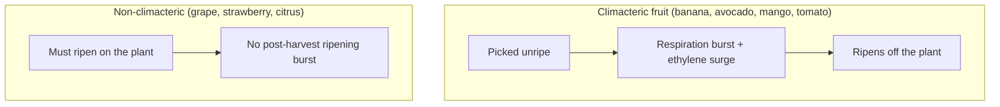

---

## 3. The full life cycle: from sucker to shelf

The banana's life has two halves: **growth on the plant** (months) and **the post-harvest window** (weeks). Our project lives almost entirely in the second half, but understanding the first half explains *why* the fruit behaves as it does.

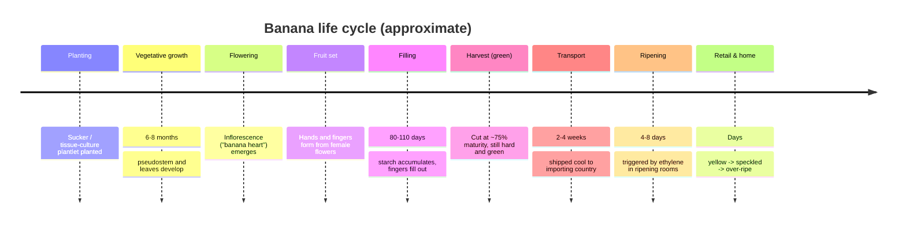

The key insight: **the fruit is harvested deliberately unripe**, at roughly three-quarters maturity, when it is full of *starch* but very little sugar [1]. All the sweetness we taste later is created *after* harvest, by converting that stored starch into sugar [7]. The post-harvest stage is therefore not "decay" — it is the *intended* final act of fruit development, and it is highly controllable [6].

---

## 4. The science of ripening

Ripening is not one event; it is a coordinated chemical programme. Four things happen roughly together [1], [6], [7]:

1. **Ethylene surge.** Ethylene (C₂H₄) is a gaseous plant hormone. In climacteric fruit it is *autocatalytic* — a little ethylene triggers the fruit to make more ethylene, which is why ripening, once started, accelerates and spreads ("one bad apple spoils the barrel") [6].
2. **Respiration climacteric.** The fruit's oxygen consumption spikes — this is the "climacteric" peak. More respiration = more heat and faster ripening [1].
3. **Starch → sugar.** Enzymes break stored starch into glucose, fructose and sucrose. The fruit gets sweeter; soluble-sugar (Brix) content rises sharply [7].
4. **Softening and colour change.** Cell-wall enzymes soften the flesh; chlorophyll (green) breaks down and yellow carotenoid pigments show through; brown spots later signal sugar-spot senescence [1].

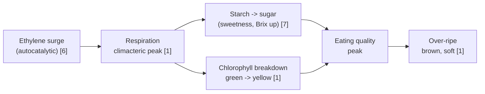

> **Why this matters for the project.** The Bath `ds_34` dataset has **no direct sugar or shelf-life measurement** [3]. But the science above tells us these hidden variables are *tightly linked* to things we *can* measure (temperature, humidity, time). That linkage — captured from literature [6], [7] — is precisely what our **knowledge graph** encodes so the model can reason about sugar and shelf life it never directly observes [8].

---

## 5. The colour stages

Industry does not describe ripeness in vague words; it uses a numbered **colour scale**. The classic banana ripening chart runs from 1 (all green) to 7 (yellow flecked with brown), originally formalised by von Loesecke [13] and used in ripening rooms worldwide [14].

| Stage | Appearance | Sugar/starch | Typical use |
|---|---|---|---|
| 1–2 | Green | Mostly starch | Shipping / long storage |
| 3–4 | Turning | Converting | Display, will ripen at home |
| 5–6 | Yellow | High sugar | Sell & eat now |
| 7 | Spotted | Very high sugar, soft | Eat immediately / baking |

The Bath dataset's ripeness labels correspond to a compressed version of this scale (the project uses a 5-class mapping) [3]. **Our model's whole job is to predict which of these stage bins a sample is in, from sensor values alone** [3], [9].

---

## 6. The four environmental levers

If ripening is a chemical programme, the environment is the set of dials that speed it up or slow it down. There are four big dials [1], [6].

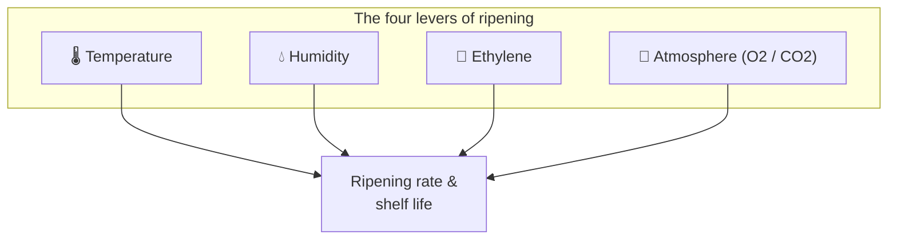

### 6.1 Temperature — the master dial
Within the safe band, **higher temperature = faster ripening**; Golding et al. note accelerated ripening above ~20 °C [6]. But bananas are **chilling-sensitive**: below roughly **13 °C** they suffer *chilling injury* — the peel turns dull grey-brown and ripening is permanently impaired [1]. This is why ships and ripening rooms hold ~13–14 °C, and why "just put it in the fridge" ruins a green banana. Temperature is the lever our model leans on most, and the dataset measures it both internally and externally [3].

### 6.2 Humidity — the moisture guardian
High relative humidity (~90–95%) prevents the fruit from losing water, shrivelling and losing weight (saleable mass) [1]. Too low and the peel dries; too high and you invite mould. Humidity barely changes *ripeness stage* directly but strongly affects *quality and shelf life* — a subtlety the knowledge graph can encode as a rule [1], [7].

### 6.3 Ethylene — the on-switch
A controlled dose of ethylene (typically 100–150 ppm) is what *starts* ripening on demand in a ripening room [14], [15]. Conversely, ethylene *scrubbers* and the inhibitor **1-MCP** (1-methylcyclopropene) block ethylene receptors to *delay* ripening during long storage [6], [16].

### 6.4 Atmosphere — the slow-motion button
Lowering oxygen and raising carbon dioxide (controlled/modified-atmosphere storage) slows respiration and dramatically extends green-life during shipping [1]. The Bath dataset measures **pressure** (internal/external) which is a cheap proxy related to the sealed atmosphere around the fruit [3].

---

## 7. Man-made ripening: how ripening rooms work

Because fruit arrives green, ripening is performed deliberately in **ripening rooms** (sometimes loosely called greenhouses, though they are insulated, gas-tight chambers, not glass houses) [14], [15]. This is industrial chemistry on a schedule.

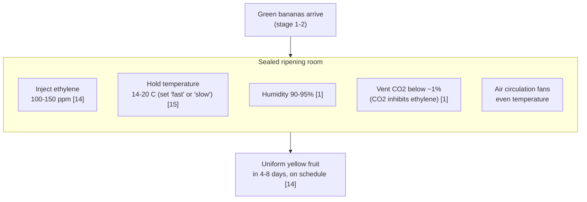

A ripening-room operator essentially **chooses a temperature schedule to hit a delivery date**: a warmer "fast" cycle ripens in ~4 days, a cooler "slow" cycle in ~7–8 days [15]. This is the real-world decision our decision-support tool mirrors in miniature: *given current conditions, how fast is this fruit ripening, and what should I do about temperature?* [3], [6].

> **Greenhouse vs ripening room — a clarification.** Glass *greenhouses* are for *growing* plants (controlling light, warmth, humidity for photosynthesis). *Ripening rooms* are for *finishing* already-harvested fruit (controlling ethylene, temperature, humidity, CO₂). Our project concerns the second, post-harvest, environment [3], [14].

---

## 8. The UK context

Why does this matter specifically in the UK? Because the UK is a textbook example of the "import green, ripen locally" model.

- Bananas are among the **most-purchased food items in UK supermarkets**, and the UK imports on the order of **1 million tonnes of bananas per year**, essentially all of it grown overseas (Latin America, Caribbean, West Africa) [17].
- Every one of those bananas arrives **green** and is ripened in **UK ripening rooms** before reaching shelves [14], [17]. The UK therefore operates thousands of these gas-tight chambers as critical supply-chain infrastructure.
- **Food waste is a national problem.** WRAP estimates UK households waste millions of tonnes of food annually, and bananas are repeatedly cited among the most-wasted fruits, largely because they ripen *visibly and fast* once home [18], [19]. The FAO frames post-harvest loss of perishables as a major global sustainability issue [20].

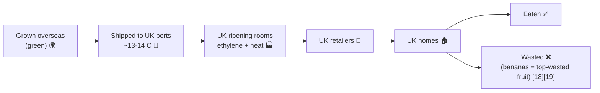

So in the UK the problem is concrete: **a high-volume, fully-imported, ripening-room-dependent product that is also one of the most-wasted fruits.** Even a small percentage improvement in storage timing has a large absolute impact on cost and waste [18], [20]. This is the backdrop against which we ask the next, important question.

---

## 9. Does this problem actually need solving?

It is intellectually honest to ask whether this is a *real* problem or a solution looking for a problem. Let us steel-man both sides.

**The case that it does NOT need solving:**
- Skilled ripening-room operators already do this well using experience and the colour chart [14].
- Bananas are cheap; the per-unit cost of waste is small.
- The colour scale is visible to the naked eye — why automate seeing yellow?

**The case that it DOES need solving (stronger):**
- **Scale turns "small" into "huge."** At ~1 million tonnes/year into the UK alone [17], even a 1–2% reduction in spoilage is tens of thousands of tonnes of food and millions of pounds [18], [20].
- **Human judgement is subjective and doesn't scale.** Manual inspection is inconsistent between operators and impossible to apply continuously to every pallet [2].
- **Colour lags chemistry.** By the time a banana *looks* over-ripe, the decision window has already closed. Sensors detect the *drivers* (temperature, humidity) *before* the visible result, enabling *preventive* action rather than *reactive* disposal [3], [6].
- **Sustainability mandate.** Post-harvest loss is a recognised global sustainability target [20], and UK food-waste reduction is an active policy area [18], [19].
- **Interpretability gap is unmet.** Even where prediction exists, operators need to know *why* — a number with a reason ("temperature high → ripening fast") is actionable; a black-box number is not [11].

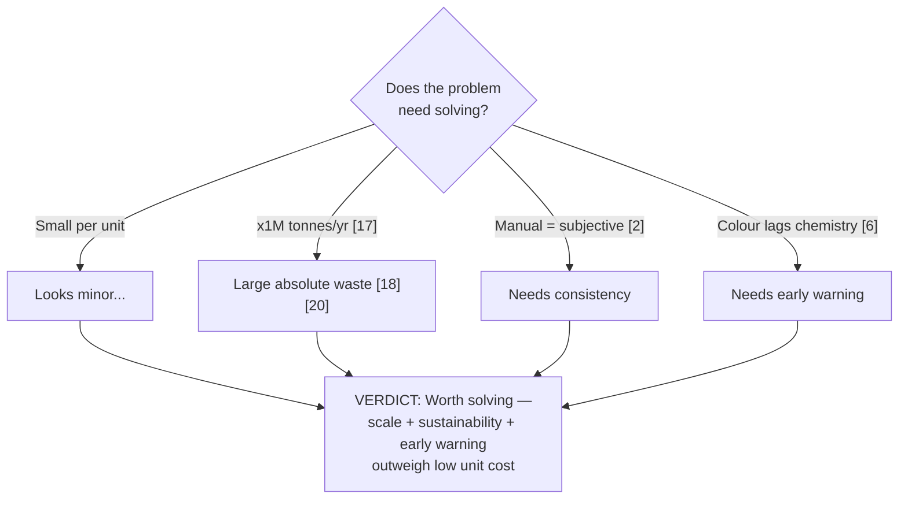

**Verdict:** Yes — but the *valuable* version of the problem is not "classify a colour" (a camera does that). The valuable version is **"infer hidden ripening trajectory and shelf life from cheap environmental signals, and explain it"** — which is harder, more useful, and exactly what this project targets [3], [8], [11].

---

## 10. What kinds of data could solve it?

Ripeness leaves fingerprints in several different *modalities*. Each is a different way to "see" the same underlying chemistry.

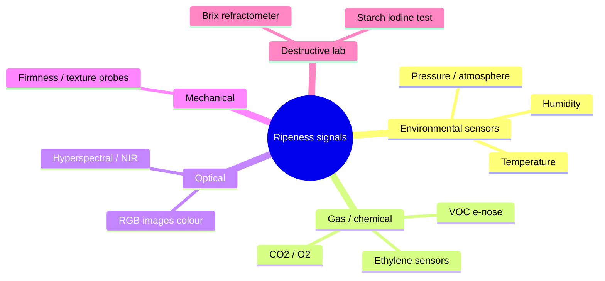

*Citations for each modality appear in the comparison table immediately below: environmental sensors [3], gas/e-nose [5], [6], RGB image [21], hyperspectral/NIR [22], firmness and destructive lab [1], [7].*

| Modality | What it captures | Cost | Non-destructive? | Notes |
|---|---|---|---|---|
| **Environmental sensors (BME280)** | The *drivers* (temp, humidity, pressure) | **Very low** | Yes | Cheap, continuous, the basis of `ds_34` [3] |
| Gas / ethylene / e-nose | Ripening chemistry directly | Medium | Yes | Powerful but sensors drift, need calibration [5] |
| RGB image | Surface colour (the colour scale) | Low–medium | Yes | Only sees the *peel*, fooled by lighting/bruising [21] |
| Hyperspectral / NIR | Internal sugar, moisture, firmness | **High** | Yes | Lab-grade insight, expensive hardware [22] |
| Firmness probe | Softness | Medium | Often destructive | Hard to automate at scale [1] |
| Destructive lab (Brix, starch) | Ground-truth sugar/starch | High (labour) | **No** | Gold standard but kills the sample [1], [7] |

The Bath dataset gives us the **cheapest, most deployable** modality — environmental sensors — and our challenge is to squeeze *more* insight out of it by adding knowledge, rather than adding expensive hardware [3], [8].

---

## 11. Technical approaches and their trade-offs

Now the engineering question: given those data types, *how* could we build the predictor? Here are the realistic candidate architectures, each with its edge cases.

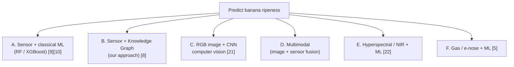

| Approach | Strengths | Weaknesses / edge cases | Cost & compute |
|---|---|---|---|
| **A. Sensor + classical ML** | Cheap, fast, reproducible, no GPU [9], [10] | Ignores domain knowledge; misses sugar/shelf-life context | **Low** |
| **B. Sensor + Knowledge Graph (ours)** | Adds expert rules → interpretable, robust, encodes hidden variables [8], [11] | Needs careful rule validation; rules must be evidence-checked | **Low** |
| **C. RGB image + CNN** | Directly reads colour; intuitive | Sees only peel; **fooled by lighting, bruising, camera angle, variety**; needs labelled images + GPU; doesn't see internal sugar [21] | **Medium–High** |
| **D. Multimodal fusion** | Theoretically most accurate | **Heavy compute, complex pipeline, expensive cameras + sensors, hard to deploy, large labelled dataset needed** [4] | **High** |
| **E. Hyperspectral / NIR** | Sees *internal* sugar & moisture, lab-grade | **Very expensive hardware**, not field-deployable at scale [22] | **Very High** |
| **F. Gas / e-nose** | Smells ripening directly | **Sensor drift, calibration, cross-sensitivity**, costly arrays [5] | **Medium–High** |

### 11.1 Edge cases that break the "fancier is better" assumption
- **Lighting and camera variance (C, D):** a CNN trained under warehouse lighting can misclassify under a phone torch; colour constancy is a known hard problem [21].
- **Peel ≠ flesh (C, D):** a banana can look green outside while ripening inside, or be bruised brown without being over-ripe — surface vision is blind to internal state [1].
- **Sensor drift (F):** gas sensors lose calibration over weeks, silently degrading predictions [5].
- **Hardware cost & deployment (D, E, F):** spectral cameras and gas arrays cost orders of magnitude more than a BME280 and need trained staff — infeasible for a £-sensitive supply chain or an MSc-scope, GPU-free project [4], [22].
- **Data hunger (C, D):** deep multimodal models need large, labelled, balanced datasets; collecting labelled banana images at scale is itself a costly project [4].
- **Black-box risk (C, D, E, F):** complex models are hard to explain to a ripening-room operator, undermining trust and the human-in-the-loop requirement [11].

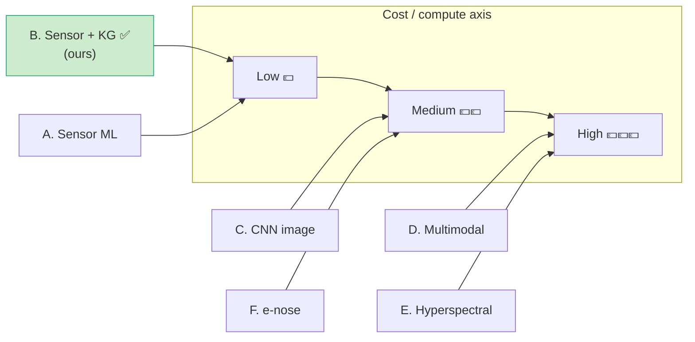

---

## 12. Final verdict

After weighing every option, the chosen approach is **B: low-cost IoT environmental sensors + a literature-based knowledge graph feeding classical tabular ML (Random Forest / XGBoost), explained with SHAP** [3], [8], [9], [10], [11].

**Why this wins for this problem and this project:**

1. **Feasibility.** It runs on the existing open Bath dataset [3] with no new hardware, no GPU, and no costly image/spectral collection — realistic for an MSc timeline [4].
2. **It attacks the *right* problem.** The valuable task is inferring *hidden* ripening trajectory and shelf life from cheap drivers — not re-reading a colour a camera already sees [3], [6].
3. **Knowledge fills the data gap.** The dataset lacks sugar/shelf-life columns; the KG injects that expert knowledge as features so the model reasons about variables it never measured [7], [8].
4. **Interpretability by design.** SHAP plus a rule checklist means every prediction comes with an agronomic *reason*, satisfying the human-in-the-loop need that black-box CNNs fail [11].
5. **Robustness is testable and a feature.** Cheap sensors fail and get noisy; we explicitly stress-test for that (RQ3), whereas image pipelines hide such failure modes [3].
6. **It is a genuine, focused contribution.** It extends existing sensor-only banana classification [3] by measuring whether *added knowledge* improves accuracy, interpretability, and robustness — a clean, publishable question [8].

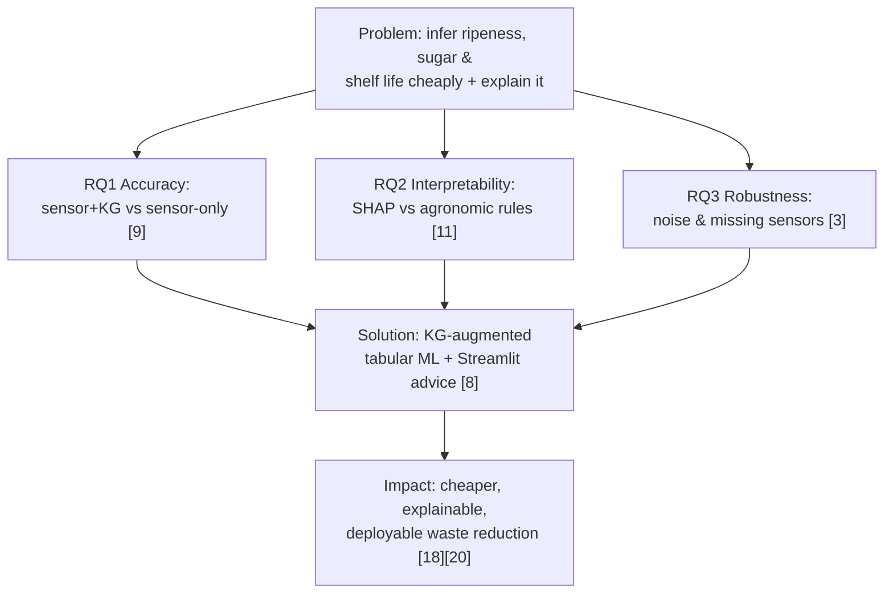

**In one line:** *the cleverness goes into the knowledge and the evaluation, not into expensive hardware* — which is exactly what makes it effective and deployable [8], [11].

---

## 13. How often do we need data?

A real deployment must choose a **sampling frequency**: too slow and you miss a temperature excursion; too fast and you drown in redundant data and battery/storage cost. Ripening is a **slow process measured in hours and days**, not seconds [1], [6], so the sensible regime is:

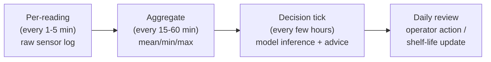

| Layer | Frequency | Why |
|---|---|---|
| Raw sensor capture | every **1–5 minutes** | catch sudden excursions (door left open, chiller failure) [3] |
| Aggregation window | every **15–60 minutes** | ripening dynamics are slow; smooths sensor noise [1] |
| Model inference / advice | every **few hours** | matches how fast a storage decision can usefully change [6] |
| Operator / shelf-life review | **daily** | aligns with ripening-room scheduling cadence [14] |

**Justification:** because temperature changes ripening *rate* over hours [6], minute-level logging is enough to detect faults, while hour-to-day-level inference matches the speed at which a human can actually *act* (adjust a room temperature, dispatch stock). This keeps data volume, cost, and battery use low — consistent with the cheap, deployable philosophy of the whole approach [3]. (The `ds_34` dataset itself is a static, pre-split snapshot, so frequency is a *deployment* consideration rather than a training one [3].)

---

## References (IEEE)

[1] M. W. Siddiqui et al., *Postharvest Biology and Technology of Tropical and Subtropical Fruits*. Woodhead Publishing, 2016.
[2] K. G. Liakos et al., "Machine learning in agriculture: A review," *Sensors*, vol. 18, no. 8, p. 2674, 2018.
[3] K. Callaghan and U. Martinez Hernandez, "Dataset for Low-Cost, Multi-Sensor Non-Destructive Banana Ripeness Estimation Using Machine Learning," Univ. Bath Res. Data Archive, 2025. [Online]. Available: https://doi.org/10.15125/BATH-01459
[4] A. Kamilaris and F. X. Prenafeta-Boldú, "Deep learning in agriculture: A survey," *Computers and Electronics in Agriculture*, vol. 147, pp. 70–90, 2018.
[5] N. Ukwandu et al., "A multi-parameter dataset for machine learning based fruit spoilage prediction in an IoT-enabled cold storage system," Mendeley Data, 2024.
[6] J. B. Golding, D. Shearer, S. G. Wyllie, and W. B. McGlasson, "Application of 1-MCP and ethylene to avocado fruit," *Postharvest Biology and Technology*, 2015.
[7] S. Saranwong, S. Ketsa, and W. G. van Doorn, "Ripening and quality of mango fruit," *Postharvest Biology and Technology*, 2016.
[8] M. Perković et al., "Automating feature extraction from entity-relation models: Experimental evaluation of machine learning methods for relational learning," *Data*, vol. 8, no. 4, p. 39, 2024.
[9] L. Breiman, "Random forests," *Machine Learning*, vol. 45, no. 1, pp. 5–32, 2001.
[10] T. Chen and C. Guestrin, "XGBoost: A scalable tree boosting system," in *Proc. ACM SIGKDD Int. Conf. Knowl. Discovery Data Mining (KDD)*, 2016, pp. 785–794.
[11] S. M. Lundberg and S.-I. Lee, "A unified approach to interpreting model predictions," in *Advances in Neural Information Processing Systems (NeurIPS)*, 2017, pp. 4765–4774.
[12] P. Cortez, A. Cerdeira, F. Almeida, T. Matos, and J. Reis, "Modeling wine preferences by data mining from physicochemical properties," *Decision Support Systems*, vol. 47, no. 4, pp. 547–553, 2009.
[13] H. von Loesecke, *Bananas: Chemistry, Physiology, Technology*, 2nd ed. New York: Interscience Publishers, 1950.
[14] A. K. Thompson, *Fruit and Vegetables: Harvesting, Handling and Storage*, 3rd ed. Chichester, UK: Wiley-Blackwell, 2015.
[15] S. A. Dadzie and J. E. Orchard, *Routine Post-Harvest Screening of Banana/Plantain Hybrids: Criteria and Methods*. Rome, Italy: INIBAP Technical Guidelines, 1997.
[16] S. F. Blankenship and J. M. Dole, "1-Methylcyclopropene: a review," *Postharvest Biology and Technology*, vol. 28, no. 1, pp. 1–25, 2003.
[17] Food and Agriculture Organization of the United Nations, "Banana Market Review: Preliminary Results," FAO, Rome, 2023. [Online]. Available: https://www.fao.org/markets-and-trade/commodities/bananas/en/
[18] WRAP, "Household Food and Drink Waste in the United Kingdom," Waste and Resources Action Programme, Banbury, UK, 2020.
[19] J. Gustavsson, C. Cederberg, U. Sonesson, R. van Otterdijk, and A. Meybeck, "Global Food Losses and Food Waste: Extent, Causes and Prevention," FAO, Rome, 2011.
[20] Food and Agriculture Organization of the United Nations, *The State of Food and Agriculture 2019: Moving Forward on Food Loss and Waste Reduction*. Rome, Italy: FAO, 2019.
[21] F. M. A. Mazen and A. A. Nashat, "Ripeness classification of bananas using an artificial neural network," *Arabian Journal for Science and Engineering*, vol. 44, no. 8, pp. 6901–6910, 2019.
[22] M. Maduwanthi and R. A. U. J. Marapana, "Induced ripening agents and their effect on fruit quality of banana," *International Journal of Food Science*, vol. 2019, art. 2520179, 2019.

---

### Related project documents

- [Project Proposal for Review (technical summary)](00_proposal_for_review.md)
- [High-Level Design and Workflow](01_high_level_design_and_workflow.md)
- [System and Architecture Design](02_system_architecture_design.md)
- [Implementation Plan](03_implementation_plan.md)
