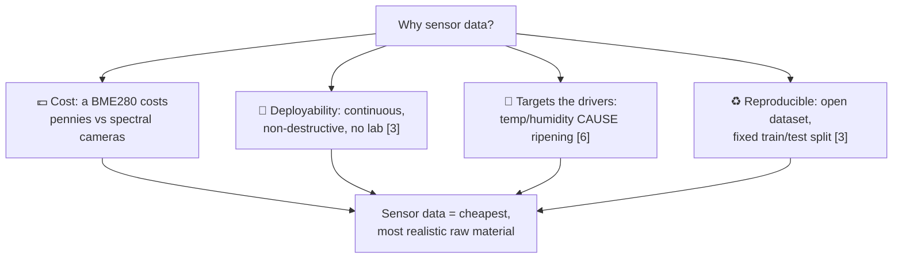
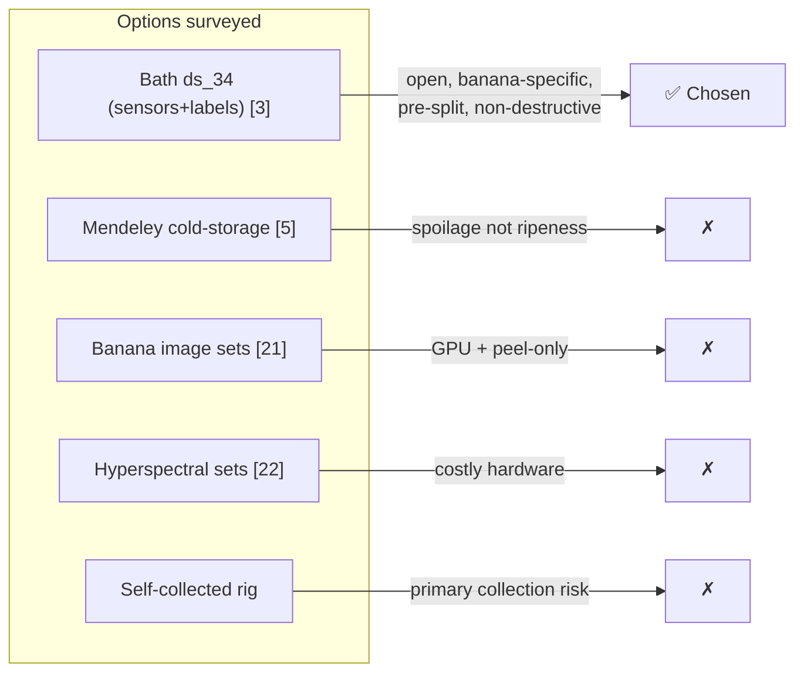
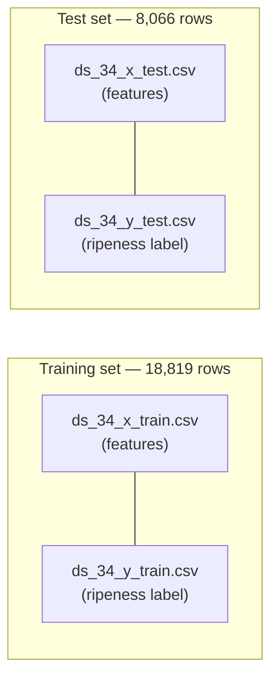
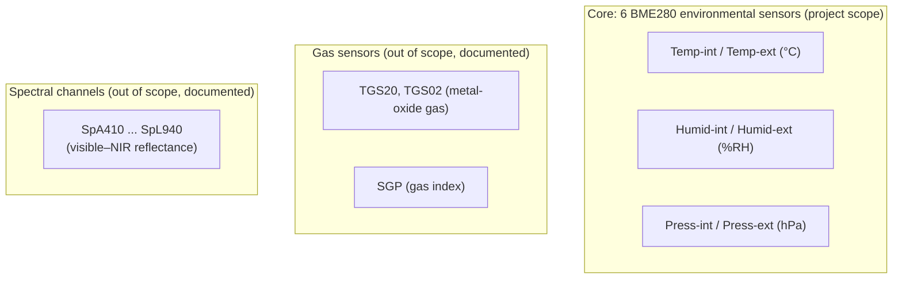
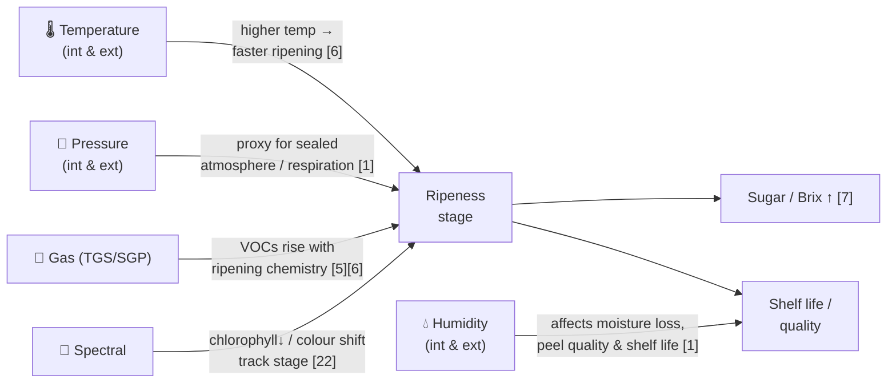
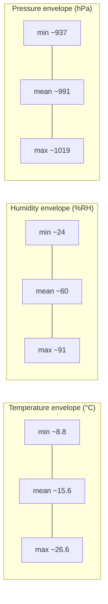
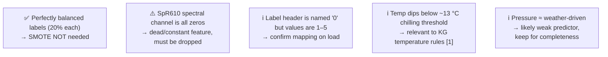

# The Data Story — Why Sensors, Which Dataset, and What Is Inside It

**Companion to the project:** Knowledge-Integrated Supervised Learning for Post-Harvest Banana Ripeness Prediction Using IoT Sensor Data
**Author:** Arbind Kumar Gauro (A00074251)

> **What this document covers.** The complete story of the *data*: why sensor data is the right raw material, what other data sources existed, why the University of Bath `ds_34` dataset was chosen, exactly what is inside it, how each measurement relates to banana ripening ("metric A affects Y"), and the real measured ranges of every variable. All figures in the range tables are computed directly from the dataset files in `data/ds_34/`. Citations use IEEE `[n]` and resolve to the [References](#references-ieee).

---

## Table of Contents

1. [Why sensor data?](#1-why-sensor-data)
2. [What data sources were available?](#2-what-data-sources-were-available)
3. [Why we chose the Bath `ds_34` dataset](#3-why-we-chose-the-bath-ds_34-dataset)
4. [What is inside the dataset](#4-what-is-inside-the-dataset)
5. [How each feature relates to banana ripening](#5-how-each-feature-relates-to-banana-ripening)
6. [The real ranges of the data](#6-the-real-ranges-of-the-data)
7. [Data quality notes and edge cases](#7-data-quality-notes-and-edge-cases)
8. [References](#references-ieee)

---

## 1. Why sensor data?

Banana ripeness can be sensed through several modalities (the full comparison is in [the lifecycle document, §10–11](04_banana_lifecycle_and_problem_context.md#10-what-kinds-of-data-could-solve-it)). For this project, **low-cost environmental sensor data** is the deliberate choice, for four reasons:

1. **Cost.** Environmental sensors (e.g. the Bosch BME280 measuring temperature, humidity and pressure) cost a few pence and run on a coin cell, versus hyperspectral cameras or gas-sensor arrays costing orders of magnitude more [3], [4].
2. **Non-destructive and continuous.** Sensors monitor fruit *in situ* without cutting or consuming it, unlike destructive Brix/starch lab tests [1], [7].
3. **They measure the *causes*, not just the symptoms.** Temperature and humidity are the *drivers* of ripening; a camera only sees the *result* (colour), which lags the chemistry [6]. Reading the drivers enables *preventive* action.
4. **Openness and reproducibility.** A published, openly licensed sensor dataset with a fixed split lets the experiment be reproduced by anyone [3], [12].

In short: sensor data is the **most feasible, most deployable, and scientifically well-targeted** raw material for a low-cost, explainable system [3], [8].

---

## 2. What data sources were available?

Choosing a dataset is itself a research decision. Several open options were considered before settling on Bath `ds_34`.

| Candidate source | Modality | Why considered | Why not chosen (for this project) |
|---|---|---|---|
| **Univ. of Bath `ds_34` banana dataset** [3] | IoT sensors (BME280 + gas + spectral) with ripeness labels | Directly about banana ripeness; open; pre-split | ✅ **Chosen** |
| Mendeley IoT cold-storage spoilage dataset [5] | Environmental sensors in cold storage | Relevant to spoilage monitoring | Targets *spoilage*, not banana *ripeness stages*; different label scheme |
| Public banana **image** datasets (e.g. Kaggle banana ripeness images) [21] | RGB images | Large, intuitive | Needs CNN + GPU; only sees peel colour; deployment-costly [4], [21] |
| Hyperspectral / NIR fruit datasets [22] | Spectral cubes | Lab-grade internal quality | Expensive hardware, not field-deployable; out of MSc scope |
| Self-collected sensor data | Custom IoT rig | Full control | Requires hardware, time, and primary data collection — high risk for an MSc timeline |

---

## 3. Why we chose the Bath `ds_34` dataset

The University of Bath banana ripeness dataset (Bath Research Data Archive, **DOI: 10.15125/BATH-01459**) was selected for a combination of practical and scientific reasons [3]:

1. **It is exactly on-topic.** It was created specifically for *non-destructive banana ripeness estimation* using low-cost multi-sensor data — the precise task of this project [3].
2. **It is open-access and free.** No cost, no licensing barrier, and no need for primary data collection [3].
3. **It provides a pre-defined train/test split.** This supports clean, reproducible experiments and prevents accidental leakage of test data into training [3], [12].
4. **It has clear ripeness labels.** Each sensor sample carries a ripeness-stage label, enabling supervised classification [3], [9].
5. **It uses genuinely cheap hardware.** The BME280 sensor is a commodity component, so any result transfers to realistic, low-budget deployments [3].
6. **It is rich enough for an ablation.** Beyond the core BME280 channels, it also includes gas and spectral channels, which let us *justify* our decision to scope the model to the cheap sensors while acknowledging what richer data could add [3].

> **Project scope decision.** Although the raw files contain gas and spectral channels, the project deliberately models the **six BME280 environmental features** (the cheapest, most deployable subset), consistent with the low-cost, explainable goal [3]. The extra channels are documented here for transparency and discussed as future work.

---

## 4. What is inside the dataset

### 4.1 Files and shape

The dataset lives in `data/ds_34/` as four CSV files following a standard supervised-learning layout:

- **Training rows:** 18,819
- **Test rows:** 8,066
- **Total:** 26,885 labelled sensor samples
- **Label:** ripeness stage as an integer **1–5** (verified directly from `ds_34_y_*.csv`)

### 4.2 The label is perfectly balanced

A direct count of the label column shows each of the five ripeness stages makes up almost exactly **20%** of both splits:

| Ripeness stage | Train count | Train % | Test count | Test % |
|---|---|---|---|---|
| 1 | 3,764 | 20.0% | 1,613 | 20.0% |
| 2 | 3,764 | 20.0% | 1,613 | 20.0% |
| 3 | 3,764 | 20.0% | 1,613 | 20.0% |
| 4 | 3,764 | 20.0% | 1,613 | 20.0% |
| 5 | 3,763 | 20.0% | 1,614 | 20.0% |

> **Important consequence for the methodology.** The proposal planned to apply **SMOTE if any class fell below 10%**. Because the dataset is *already perfectly balanced*, **SMOTE is not required** — the trigger condition never fires. This is a positive simplification, and macro-F1 vs accuracy will track closely. (This should be reflected when the pipeline is rebuilt; see the [implementation plan, Phase 1](03_implementation_plan.md#phase-1--data-acquisition-and-preprocessing).)

### 4.3 The feature columns

Each `x` row begins with an index column, followed by feature groups:

- **Six BME280 environmental features (the project's inputs):** `Temp-int`, `Humid-int`, `Press-int`, `Temp-ext`, `Humid-ext`, `Press-ext`. "int"/"ext" distinguish sensors placed *inside* the fruit enclosure versus the *ambient* surroundings [3].
- **Gas channels (documented, not modelled):** `TGS20`, `TGS02` (Figaro-style metal-oxide gas sensors sensitive to volatile organic compounds) and `SGP` (a gas index). These respond to ripening VOCs/ethylene by-products [5], [6].
- **Spectral channels (documented, not modelled):** `SpA410`–`SpL940`, a visible-to-near-infrared reflectance spectrum that relates to peel pigment/colour and internal composition [22].

---

## 5. How each feature relates to banana ripening

This is the "metric A affects Y" map — the physical reason each measurement carries information about ripeness. These relationships are exactly what the **knowledge graph** encodes as rules and features [6], [7], [8].

| Feature | Physical meaning | How it relates to ripeness | Direction of effect | Citation |
|---|---|---|---|---|
| **Temp-int / Temp-ext** | Temperature inside fruit enclosure / ambient (°C) | Master driver of ripening rate; warmth accelerates the ripening programme | ↑ temp ⇒ ↑ ripening rate (within safe band; chilling injury below ~13 °C) | [1], [6] |
| **Humid-int / Humid-ext** | Relative humidity inside / ambient (%RH) | Governs moisture loss; high RH preserves weight, peel quality and shelf life | ↑ humidity ⇒ ↓ moisture loss ⇒ longer shelf life | [1] |
| **Press-int / Press-ext** | Air pressure inside / ambient (hPa) | Proxy for the sealed micro-atmosphere and respiration around the fruit | shifts with atmosphere/respiration state | [1] |
| **TGS20 / TGS02** | Metal-oxide gas sensor response | Detects volatile organic compounds released during ripening | ↑ VOCs ⇒ more advanced ripening | [5], [6] |
| **SGP** | Gas index | Aggregate gas/air-quality signal linked to ripening emissions | rises with ripening activity | [5] |
| **SpA410–SpL940** | Visible–NIR reflectance per wavelength | Chlorophyll breakdown and carotenoid build-up shift the spectrum green→yellow | spectral shift tracks colour stage | [22] |
| **Label (1–5)** | Ripeness stage (target) | The supervised target the model predicts | — | [3] |

**The hidden variables.** Note that **sugar (Brix) and shelf life are *not* columns** in the dataset [3]. Yet section 5 shows they are physically downstream of temperature, humidity and time [6], [7]. This is the whole rationale for the knowledge graph: it lets the model *reason about* sugar and shelf life through validated literature rules, even though it never directly measures them [7], [8].

---

## 6. The real ranges of the data

The tables below are **computed directly** from `ds_34_x_train.csv` (18,819 rows). They define the realistic operating envelope and the basis for range-validation thresholds and knowledge-graph rule boundaries [3].

### 6.1 Core BME280 features (project scope)

| Feature | Unit | Min | Max | Mean | Std | Comment |
|---|---|---|---|---|---|---|
| **Temp-int** | °C | 9.44 | 23.95 | 15.83 | 2.82 | Spans cool storage to warm ripening; note values dip below the ~13 °C chilling threshold [1] |
| **Temp-ext** | °C | 8.84 | 26.64 | 15.48 | 3.05 | Ambient swings wider than internal |
| **Humid-int** | %RH | 48.75 | 81.61 | 63.26 | 8.05 | Moderate-to-high humidity |
| **Humid-ext** | %RH | 23.96 | 91.03 | 56.73 | 11.69 | Ambient humidity far more variable |
| **Press-int** | hPa | 937.15 | 1018.43 | 990.98 | 13.31 | Near sea-level atmospheric range |
| **Press-ext** | hPa | 937.30 | 1018.73 | 991.38 | 13.26 | Tracks internal pressure closely |

**Reading the envelope.** Temperature sits mostly in the **9–24 °C** band — i.e. from cool storage up into the active ripening range, consistent with experimental ripening conditions [6]. Internal humidity is held in a tighter, higher band than ambient, as expected when fruit is enclosed [1]. Pressure varies only with weather (≈937–1019 hPa) and so carries weak direct ripeness signal but is retained for completeness [1].

### 6.2 Gas and spectral channels (documented, out of scope)

| Feature | Min | Max | Mean | Note |
|---|---|---|---|---|
| TGS20 | 116 | 2,712 | 1,056 | Wide dynamic range; strong VOC signal [5] |
| TGS02 | 375 | 4,230 | 2,896 | Largest gas response |
| SGP | 55.96 | 126.0 | 113.64 | Gas index, mostly high |
| SpA410 (violet) | 0.0 | 19.31 | 4.93 | Strongest spectral channel |
| SpF535 (green) | 0.0 | 14.11 | 8.12 | Tracks chlorophyll [22] |
| SpW860 (NIR) | 0.0 | 11.50 | 2.69 | Near-infrared band |
| **SpR610 (orange)** | 0.0 | **0.0** | 0.0 | **Dead channel — all zeros (see §7)** |

*(Remaining spectral channels SpB435, SpC460, SpD485, SpE510, SpG560, SpH585, SpI645, SpS680, SpJ705, SpT730, SpU760, SpV810, SpK900, SpL940 fall within 0–7 reflectance units; full per-column statistics are reproducible from the training CSV.)*

---

## 7. Data quality notes and edge cases

An honest data story includes its flaws. The following were found by inspecting the files directly:

1. **Perfectly balanced classes (20% each).** This removes the need for SMOTE that the proposal had planned as a contingency; accuracy and macro-F1 will be closely aligned, simplifying RQ1 [3].
2. **`SpR610` is a constant zero column.** A feature with zero variance carries no information and can break some statistics; it must be dropped during preprocessing. (It does not affect the six BME280 features the project actually uses.)
3. **Label column header quirk.** The label column is headed `0` in the CSV, but its *values* are the integers 1–5; the loader should map by position, not header name.
4. **Temperatures below the chilling threshold.** Internal temperature reaches ~9.4 °C and ambient ~8.8 °C, below the ~13 °C banana chilling-injury threshold [1] — useful context when setting "low/high temperature" knowledge-graph rule boundaries [6].
5. **Pressure is weather-dominated.** With a range of just ~937–1019 hPa tracking atmospheric weather, pressure likely contributes little direct ripeness signal but is retained for transparency and completeness [1].

These observations directly inform Phase 1 (preprocessing) and Phase 3 (rule thresholds) of the [implementation plan](03_implementation_plan.md).

---

## References (IEEE)

[1] M. W. Siddiqui et al., *Postharvest Biology and Technology of Tropical and Subtropical Fruits*. Woodhead Publishing, 2016.
[2] K. G. Liakos et al., "Machine learning in agriculture: A review," *Sensors*, vol. 18, no. 8, p. 2674, 2018.
[3] K. Callaghan and U. Martinez Hernandez, "Dataset for Low-Cost, Multi-Sensor Non-Destructive Banana Ripeness Estimation Using Machine Learning," Univ. Bath Res. Data Archive, 2025. [Online]. Available: https://doi.org/10.15125/BATH-01459
[4] A. Kamilaris and F. X. Prenafeta-Boldú, "Deep learning in agriculture: A survey," *Computers and Electronics in Agriculture*, vol. 147, pp. 70–90, 2018.
[5] N. Ukwandu et al., "A multi-parameter dataset for machine learning based fruit spoilage prediction in an IoT-enabled cold storage system," Mendeley Data, 2024.
[6] J. B. Golding, D. Shearer, S. G. Wyllie, and W. B. McGlasson, "Application of 1-MCP and ethylene to avocado fruit," *Postharvest Biology and Technology*, 2015.
[7] S. Saranwong, S. Ketsa, and W. G. van Doorn, "Ripening and quality of mango fruit," *Postharvest Biology and Technology*, 2016.
[8] M. Perković et al., "Automating feature extraction from entity-relation models: Experimental evaluation of machine learning methods for relational learning," *Data*, vol. 8, no. 4, p. 39, 2024.
[9] L. Breiman, "Random forests," *Machine Learning*, vol. 45, no. 1, pp. 5–32, 2001.
[10] T. Chen and C. Guestrin, "XGBoost: A scalable tree boosting system," in *Proc. ACM SIGKDD Int. Conf. Knowl. Discovery Data Mining (KDD)*, 2016, pp. 785–794.
[11] S. M. Lundberg and S.-I. Lee, "A unified approach to interpreting model predictions," in *Advances in Neural Information Processing Systems (NeurIPS)*, 2017, pp. 4765–4774.
[12] P. Cortez, A. Cerdeira, F. Almeida, T. Matos, and J. Reis, "Modeling wine preferences by data mining from physicochemical properties," *Decision Support Systems*, vol. 47, no. 4, pp. 547–553, 2009.
[21] F. M. A. Mazen and A. A. Nashat, "Ripeness classification of bananas using an artificial neural network," *Arabian Journal for Science and Engineering*, vol. 44, no. 8, pp. 6901–6910, 2019.
[22] M. Maduwanthi and R. A. U. J. Marapana, "Induced ripening agents and their effect on fruit quality of banana," *International Journal of Food Science*, vol. 2019, art. 2520179, 2019.

---

### Related project documents

- [Project Proposal for Review (technical summary)](00_proposal_for_review.md)
- [High-Level Design and Workflow](01_high_level_design_and_workflow.md)
- [System and Architecture Design](02_system_architecture_design.md)
- [Implementation Plan](03_implementation_plan.md)
- [The Life of a Banana — lifecycle & problem context](04_banana_lifecycle_and_problem_context.md)
